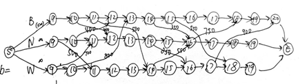
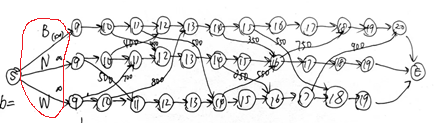
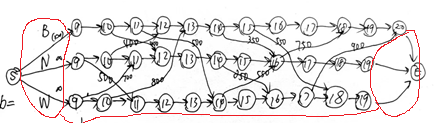

# 案例分析 Braneast 航空公司的航线安排

### Parameters
机场编号（1-波士顿(B),2-纽约(N)，3-华盛顿(W)）

$i$:出发机场编号$(i=1,2,3)$
$j$:到达机场编号$(j=1,2,3)$
$ts$ 出发时间$(ts = 9,10,..,20)$
$te$ 到达时间$(te = 9，10,...,20)$

节点$node[i,t]$:机场$i$，时刻$t$代表的节点。

$node[1,8]$:虚拟的起始节点S
$node[1,21]$:虚拟的终止节点E

$flow[i,j,ts,te]$ $node[i,ts]$到$node[j,te]$的最大流量
>即从机场$i$飞往机场$j$，起飞时间为$ts$,到达时间为$te$的航线的最大流量。

$revenue[i,j,ts,te]$ $node[i,ts]$到$node[j,te]$的利润
>即从机场$i$飞往机场$j$，起飞时间为$ts$,到达时间为$te$的航线的利润

$L$代表了所有可行航线$<i,j,ts,te>$的集合。

$L^{+}$代表了包括$L$中的所有航线，以及起始节点S与结束节点E的虚拟航线的集合。

### Decision Variables

$f[i,j,ts,te]$:$node[i,ts]$到$node[j,te]$的流量

---

## 第一问
### Objective function
机队数量最少(最小化总流量) **(1)**
$$Obj1 = \sum_{j=1}^{3}f[1,j,8,9]$$
相当于最小化从虚拟的起始点S到三个机场9：00节点的流量之和。

### Constraints
航线$<i,j,ts,te>$的流量不超过最大流量限制:
$$f[i,j,ts,te] <= flow[i,j,ts,te]$$
**(航线流量满足：$f[i,j,ts,te] = flow[i,j,ts,te]$)**

除起始节点S和结束节点E外，其他的每个节点$node[i,ts]$的流入流量=流出流量：
$$ \sum_{<h,i,th,ts>\in L^+ } f[h,i,th,ti] = \sum_{<i,j,ti,tj>\in L^+} f[i,j,ti,tj]$$

起始节点S的流出流量=结束节点E的流入流量：

$$\sum_{j=1}^{3} f[1,j,8,9] = f[1,1,20,21] + f[2,1,19,21]+f[3,1,19,21] $$

---
## 第二问
### Objective function
利润最高
$$Obj2 = \sum_{<i,j,ts,te> \in L}  f[i,j,ts,te] * revenue[i,j,ts,te] $$

机场内部的边revenue=0，航线边revenue为运营该航线的收入-成本。

### Constraints
航线$<i,j,ts,te>$的流量不超过最大流量限制:
$$f[i,j,ts,te] <= flow[i,j,ts,te]$$

除起始节点S和结束节点E外，其他的每个节点$node[i,ts]$的流入流量=流出流量：
$$ \sum_{<h,i,th,ts>\in L^+ } f[h,i,th,ti] = \sum_{<i,j,ti,tj>\in L^+} f[i,j,ti,tj]$$

起始节点S的流出流量=结束节点的流入流量：

$$\sum_{j=1}^{3} f[1,j,8,9] = f[1,1,20,21] + f[2,1,19,21]+f[3,1,19,21] $$

--- 
### 第三问
第二问目标函数中，令机场内部的边revenue = -50即可。