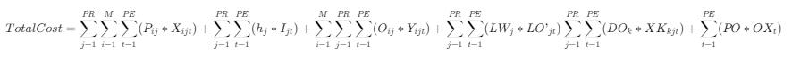
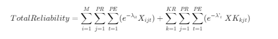

# 案例 3. 城际列车的运行图安排——参考求解

## Parameters

M ： 上行列车数量
N ： 下行线路数量
MOTIVE_NUM :可用的列车数量

$weightTrainup[i]$:上行线路的客流量

$ weightTraindown[j]$ 下行线路的客流量

$tismin[i],tismax[i]$ 上行线路最早/最晚的出发时间
$ tiemin[i],tiemax[i]$上行线路最早/最晚的到达时间

$tjsmin[j],tjsmax[j]$ 下行线路最早/最晚的出发时间
$ tjemin[j],tiemax[j]$下行线路最早/最晚的到达时间

技术等待时间
$theta_i = 20$
$theta_j = 30$

最小列车间隔 12 分钟
$H\_UP\_MIN = 12$
$H\_DOWN\_MIN = 12$

## Decision Variables

$xup_{i,j,k}$ (binary)列车$k$执行完上行线路$i$后是否立即执行下行线路$j$

$xdown_{j,i,k}$ (binary)列车$k$执行完下行线路$j$后是否立即执行上行线路$i$

$xe_{k}$(binary)是否使用列车$k(k=1,2,...,NTRAINS)$

$tups_{i}$ 上行线路$i$的实际出发时间
$tupe_{i}$ 上行线路$i$的实际到达时间
$tdowns_{j}$ 下行线路$j$的实际出发时间
$tdowne_{j}$ 下行线路$j$的实际到达时间

## Objective function(s)

obj1:使用的机车数量最少

$$ \sum {k=1}^{NTRAINS} xe {k} $$

obj2:机车总怠速时间最少(不计出库与入库怠速时间)

$$\sum_{k=1}^{NTRAINS}\sum_{i=1}^{M}\sum_{j=1}^{N}((tdowns_{j}-tupe_{i})   xup_{i,j,k} + (tups_{i}-tdowne_{j}) xdown_{j,i,k}$$

> obj2 一个非线性约束，需要转化为线性约束,例如：
> $$z =  (tdowns_{j}-tupe_{i})   xup_{i,j,k}$$
> 可以转化为：
> $$ z = yup {i,j,k} $$
>  s.t._
> $$ yup*{i,j,k} <= M * x {i,j,k}$$
> $$ yup {i,j,k} - (tdowns {j}-tupe {i}) <= M\_ (1-xup {i,j,k})$$
> $$ yup {i,j,k} - (tdowns {j}-tupe {i}) >= M\ (xup {i,j,k}-1)$$
> $$ yup {i,j,k}>0 $$

## 约束

对于每辆列车 k，除了最后的入库操作外，每个上行线路$(i=1,...,M)$之前只有一个下行线路，每个下行线路$(j=1,...,N)$前只有一个上行线路。

$i,j=0$：进入出库线路
$i=M+1;j=N+1$:进入回库线路

$$ \sum {k=1}^{NTRAINS}\sum {j=0}^{N} xdown\_{j,i,k} = 1 (i=1,2,..,M)$$

$$ \sum {k=1}^{NTRAINS}\sum {i=0}^{M} xup\_{i,j,k} = 1 (j=1,2,..,N)$$

列车$k$的运行线路是连续的,
$$\sum_{i=0}^{M}xup_{i,j,k} <= \sum_{i=1}^{M+1} xdown_{j,i,k} (j=1,2,..,N;k=1,2,..,NTRAINS)$$

$$\sum_{j=0}^{N}xdown_{j,i,k} <= \sum_{j=1}^{N+1} xup_{i,j,k} (i=1,2,..,M;k=1,2,..,NTRAINS)$$

对于回库线路($i=M+1;j=N+1$),该线路之前可能对于多条下行线$j$/多条上行线$i$

如果列车$k$上线运行$(xe_{k}=1)$，则必须经过出库线(从 A 出库 i=0，还是从 B 出库 j=0)和入库线(A 入库 j=N+1;B 入库 i=M+1)。

$$\sum_{j=1}^{N}xup_{0,j,k} + \sum_{i=1}^{M}xdown_{0,i,k} <= xe_{k} (k=1,2,..,NTRAINS)$$

$$\sum_{i=1}^{M}xup_{i,N+1,k} + \sum_{j=1}^{N}xdown_{j,M+1,k} <= xe_{k} (k=1,2,..,NTRAINS)$$

如果列车$k$不上线运行，则任意
$$xup_{i,j,k}=0;xdown_{j,i,k} = 0$$
$$i=0,1,..,M+1;j=0,1,...,N+1 $$

运行时间约束
$$tismin[i] <= tups[i] <= tismax[i]$$
$$tiemin[i] <= tupe[i] <= tiemax[i]$$
$$tjsmin[i] <= tdowns[j] <= tjsmax[i]$$
$$tjemin[i] <= tdowne[j] <= tjemax[i]$$

牵引重量限制
$$\sum_{k=1}^{NTRAINS}\sum_{j=1}^{N+1} weight_{k}  xup_{i,j,k} >= weightUp_{i} (i=1,2,...,M)$$

$$\sum_{k=1}^{NTRAINS}\sum_{i=1}^{M+1} weight_{k}  xdown_{j,i,k} >= weightDown_{j} (j=1,2,...,N)$$

# 案例 4. 供应链问题————参考求解

## 参数

$SC[j,t]$ 中央仓库在 t 时刻商品 j 的最大库存容量

$SO[j]$ 临时仓库存储商品 j 的最大容量

$ C[i,j,t] $ 供应商 i 的在 t 时间对于商品 j 最大供应能力

$ DK[k,j,t]$ 批发商 k 在 t 时间对于商品 j 的需求

$P[i,j]$从供应商 i 处购买商品 j 的价格

$st[i,j]$ 供应商 i 准备商品 j 所需要的时间

$LT[j,t]$ 商品 j 在 t 时期最大准备时间

$h[j]$ 仓库持有商品 j 的单位持有成本

$LW[j]$ 仓库销售商品 j 的销售损失成本

$Qa[j]$ 仓库对商品 j 的合格率要求

$O[ij]$ 仓库向供应商 i 订购商品 j 的固定订货成本

$DO[k]$ 仓库向批发商 k 运输商品的单位运输成本

$W[i]$ 供应商 i 的权重

$Rs[i,t]$ 供应商 i 在 t 时刻的可信度

$Rw[t]$ 仓库在 t 时刻的可信度

## 决策变量

$X[ijt]$ 第 t 个期间向第 i 个供应商订购的第 j 个产品的数量

$XK[kjt]$ 第 t 期中央仓库向批发商 k 发送的第 j 个产品的数量

$I[j，t]$ 第 t 期第 j 个产品的库存

$D[jt]$ 第 t 个期间中心仓库对第 j 个产品的需求

$L[jt]$ 第 j 期第 j 个产品的库存金额

$LO'[jt]$ 中央仓库第 j 个期末第 j 个产品的销售额损失

$OX[t]$第 t 期建立的临时仓库数量

$Y[ijt]$（当选择第 i 个供应商在第 t 个周期内供应第 j 个产品时，取值为 1；否则等于 0

$B[kjt]$（0-1 变量）当批发商 k 的需求在第 t 个周期内满足第 j 个产品时，取值为 1；否则，它等于 0。

## 目标函数

$$ min z = 0.5 TotalCost - 0.3 TotalWeight -0.2 TotalReliability $$

## 约束

总成本 = 供货商采购成本 + 仓储成本 + 订货成本+批发商销售损失成本 + 临时仓库建立成本

<!--  -->

$$
TotalCost=\sum_{j=1}^{PR}\sum_{i=1}^{M}\sum_{t=1}^{PE}(P_{ij}   X_{ijt}) +\sum_{j=1}^{PR}\sum_{t=1}^{PE}(h_j I_{jt}) +\sum_{i=1}^{M}\sum_{j=1}^{PR} \sum_{t=1}^{PE}(O_{ij} Y_{ijt}) +\sum_{j=1}^{PR}\sum_{t=1}^{PE}(LW_j LO’_{jt})
\sum_{j=1}^{PR}\sum_{t=1}^{PE}(DO_k XK_{kjt})+\sum_{t=1}^{PE}(PO OX_t)
$$

供应商的权重与订货量的权重之和
$$TotalWeight=\sum_{i=1}^M\sum_{j=1}^{PR}\sum_{t=1}^{PE}(W_i\cdot X_{ijt}) $$

供应商的可信值
$$TotalReliability=\sum_{i=1}^{M}\sum_{j=1}^{PR}\sum_{t=1}^{PE}(e^{-\lambda_{it} }X_{ijt})+\sum_{k=1}^{KR}\sum_{j=1}^{PR} \sum_{t=1}^{PE}(e^{-\lambda’_t}\ XK_{kjt})$$

<!--  -->

从供货商拿到的商品数量$X_{i,j,t}$不得超过最大供应能力$C_{i,j,t}$限制(10)
$$ X {i,j,t} <= C {i,j,t} $$

是否从某个供应商供货$Y_{ijt}$应该满足的限制
$$ X {ijt} <= BIGM · Y\_{ijt} (BIGM 是一个很大的正数)$$

从供货商拿到的商品次品率不得高于仓库的次品率限制（9）
$$ \sum*{i=1}^{M}(X*{ijt}.qa_i)\leq Qa_j.D {jt} $$

从各家供货商拿货的总时间不得超过时间$LT_{jt}$限制(11)
$$ \sum*{i=1}^{M} st*{ij} Y*{i,j,t} <= LT*{ij} $$

仓库的库存不得超过仓库的仓储能力(中央仓库+临时仓库)限制
$$ \sum*{i=1}^{M} X*{i,j,t} + I*{j,t-1} <= SC*{jt} + SO*{j} \ OX*{t}$$

从供应商处的订货量 + 上一期末的库存 - 销售给批发商的数量 = 本期末库存 （5）
$$ \sum*{i=1}^MX*{ijt}+I*{jt-1}-\sum*{k=1}^{KR} XK*{kjt}=I*{jt} $$

批发商的需求被满足（$B_{kjt}$在 t 时刻是否满足批发商 k 的商品 j 的需求）（6）
$$ D*{jt}=\sum*{k=1}^{KR} DK*{kjt}.B*{kjt} $$

批发商的需求 = 供应给批发商的数量+ 销售损失
$$ XK*{kjt} + LO*{jt}^{'} = DK\_{kjt} $$

以上
$$i=1,2,....,7;j=1,2,3;k=1,2,...,16$$

# 无人机与货车混合送货问题

## 参数设置

$c$ 客户的数量
0，c+1 都代表了配送中心节点（一个是开始节点，一个是结束节点）
$1,2,...,c$代表了 c 个客户的节点

$times[i][j]$ 卡车从节点 i 到节点 j 的时间
$times1[i][j]$ 无人机从节点 i 到节点 j 的时间
$sL$发射无人机的准备时间
$sR$回收无人机的恢复时间
$e$无人机的飞行续航时间

# 目标函数

# 案例 6 Braneast 航空公司的航线安排

## Parameters

机场编号（1-波士顿,2-纽约，3-华盛顿）

$i$:出发机场编号$(i=1,2,3)$
$j$:到达机场编号$(j=1,2,3)$
$ts$ 出发时间$(ts = 9,10,..,20)$
$te$ 到达时间$(te = 9，10,...,20)$

节点$node[i,t]$:机场$i$，时刻$t$代表的节点。

<!--  -->

$node[1,8]$:虚拟的起始节点 S
$node[1,21]$:虚拟的终止节点 E

$flow[i,j,ts,te]$ $node[i,ts]$到$node[j,te]$的最大流量

> 即从机场$i$飞往机场$j$，起飞时间为$ts$,到达时间为$te$的航线的最大流量。

$revenue[i,j,ts,te]$ $node[i,ts]$到$node[j,te]$的利润

> 即从机场$i$飞往机场$j$，起飞时间为$ts$,到达时间为$te$的航线的利润

$L$代表了所有可行航线$<i,j,ts,te>$的集合。

$L^{+}$代表了包括$L$中的所有航线，以及起始节点 S 与结束节点 E 的虚拟航线的集合。

## Decision Variables

$f[i,j,ts,te]$:$node[i,ts]$到$node[j,te]$的流量

## Objective function(s)

机队数量最少(最小化总流量)
$$Obj1 = \sum_{j=1}^{3}f[1,j,8,9]$$

利润最高
$$Obj2 = \sum_{<i,j,ts,te> \in L}  f[i,j,ts,te]   revenue[i,j,ts,te] $$

## Constraints

航线$<i,j,ts,te>$的流量不超过最大流量限制:
$$f[i,j,ts,te] <= flow[i,j,ts,te]$$

除起始节点 S 和结束节点 E 外，其他的每个节点$node[i,ts]$的流入流量=流出流量：
$$ \sum {<h,i,th,ts>\in L^+ } f[h,i,th,ti] = \sum {<i,j,ti,tj>\in L^+} f[i,j,ti,tj]$$

起始节点 S 的流出流量=结束节点的流入流量：

$$\sum_{j=1}^{3} f[1,j,8,9] = f[1,1,20,21] + f[2,1,19,21]+f[3,1,19,21] $$
